# Carcinogenic Product Identifier Application Documentation

## Table of Contents
1. [Project Overview](#project-overview)
2. [Technical Architecture](#technical-architecture)
3. [Database Design](#database-design)
4. [User Interface](#user-interface)
5. [API Integration](#api-integration)
6. [Security Features](#security-features)
7. [Development Setup](#development-setup)
8. [Build and Deployment](#build-and-deployment)
9. [Testing](#testing)
10. [Maintenance and Updates](#maintenance-and-updates)

## Project Overview

### Purpose
The Carcinogenic Product Identifier Application is designed to help users identify and track products that may contain potentially carcinogenic substances. The application provides a user-friendly interface for searching, analyzing, and managing product information.

### System Architecture Diagram
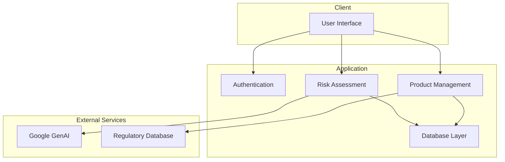

### Key Features
- Product search and identification
- Carcinogenic substance database
- User authentication and authorization
- Product risk assessment
- Data export capabilities
- Real-time updates

## Technical Architecture

### Technology Stack
- **Programming Language**: Java 21
- **Database**: SQLite
- **UI Framework**: Java Swing
- **Build Tool**: Maven
- **Dependencies**:
  - Google GenAI SDK
  - SQLite JDBC Driver
  - Gson for JSON handling
  - JUnit for testing

### Component Interaction Diagram
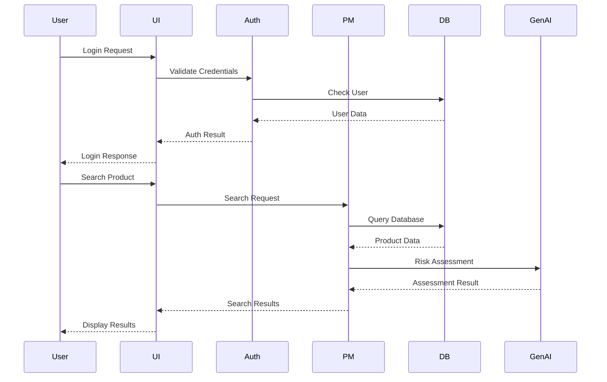

### Project Structure
```
src/
├── main/
│   ├── java/
│   │   └── com/
│   │       └── example/
│   │           └── CarcinogenicProductIdentifier/
│   │               ├── Main.java
│   │               ├── database/
│   │               ├── model/
│   │               └── ui/
│   └── resources/
└── test/
    └── java/
        └── com/
            └── example/
                └── CarcinogenicProductIdentifier/
                    └── tests/
```

## Database Design

### Database Schema Diagram
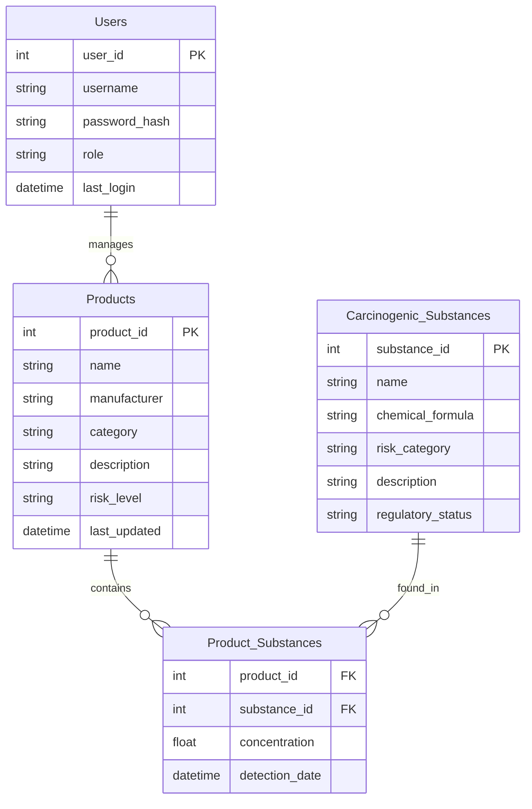

### Schema Overview
The application uses SQLite for data storage with the following main tables:

1. **Products**
   - Product ID (Primary Key)
   - Name
   - Manufacturer
   - Category
   - Description
   - Risk Level
   - Last Updated

2. **Carcinogenic Substances**
   - Substance ID (Primary Key)
   - Name
   - Chemical Formula
   - Risk Category
   - Description
   - Regulatory Status

3. **Product_Substances**
   - Product ID (Foreign Key)
   - Substance ID (Foreign Key)
   - Concentration
   - Detection Date

4. **Users**
   - User ID (Primary Key)
   - Username
   - Password Hash
   - Role
   - Last Login

### Data Flow Diagram
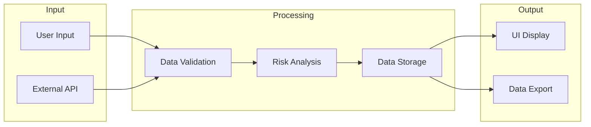

### Database Operations
- CRUD operations for products and substances
- Search and filtering capabilities
- Data validation and integrity checks
- Backup and restore functionality

## User Interface

### UI Component Hierarchy
```mermaid
graph TD
    subgraph Main Window
        Login[Login Screen]
        Dashboard[Dashboard]
        ProductMgmt[Product Management]
        Reports[Reports]
    end
    
    subgraph Dashboard Components
        Search[Search Panel]
        QuickAccess[Quick Access]
        Status[Status Panel]
        Profile[Profile Management]
    end
    
    subgraph Product Management
        Add[Add Product]
        Edit[Edit Product]
        Delete[Delete Product]
        Import[Import/Export]
    end
    
    Main Window --> Login
    Main Window --> Dashboard
    Main Window --> ProductMgmt
    Main Window --> Reports
    
    Dashboard --> Search
    Dashboard --> QuickAccess
    Dashboard --> Status
    Dashboard --> Profile
    
    ProductMgmt --> Add
    ProductMgmt --> Edit
    ProductMgmt --> Delete
    ProductMgmt --> Import
```

### Login Screen
- Username/password authentication
- Password recovery option
- Remember me functionality
- Session management

### Main Dashboard
- Product search interface
- Quick access to common functions
- System status indicators
- User profile management

### Product Management
- Add/Edit/Delete products
- Bulk import/export
- Product categorization
- Risk assessment tools

### Reporting
- Custom report generation
- Data visualization
- Export options (PDF, CSV, Excel)
- Scheduled reports

## API Integration

### API Integration Diagram
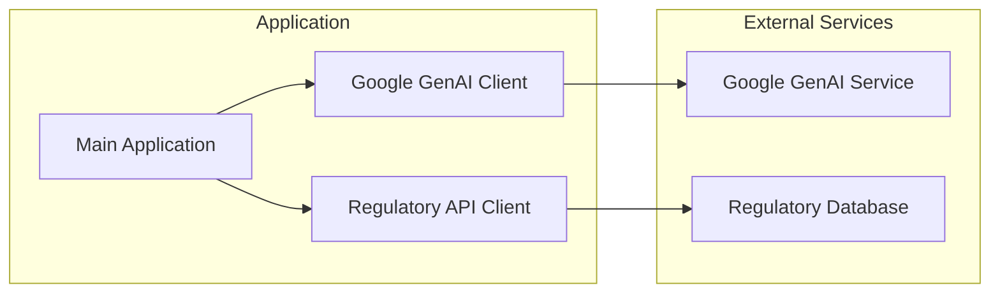

### Google GenAI Integration
- Natural language processing for product analysis
- Risk assessment algorithms
- Text classification
- Sentiment analysis

### External APIs
- Product database synchronization
- Regulatory updates
- Market data integration
- Weather impact analysis

## Security Features

### Security Architecture
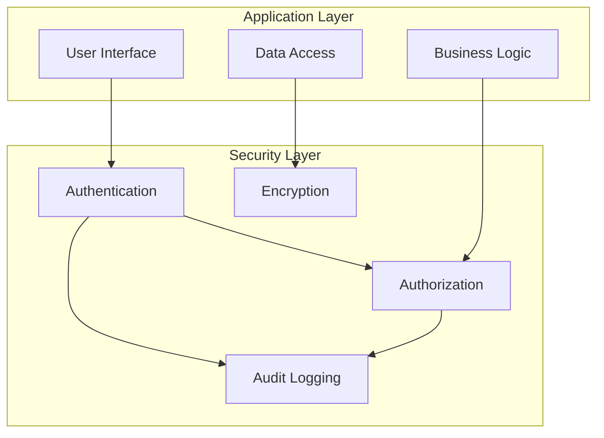

### Authentication
- Secure password hashing
- Session management
- Token-based authentication
- Role-based access control

### Data Protection
- Encrypted database
- Secure data transmission
- Regular security audits
- Backup and recovery procedures

### Compliance
- GDPR compliance
- Data retention policies
- Privacy controls
- Audit logging

## Development Setup

### Prerequisites
- JDK 21 or later
- Maven 3.8 or later
- Git
- IDE (recommended: IntelliJ IDEA or Eclipse)

### Local Development
1. Clone the repository
2. Install dependencies:
   ```bash
   mvn clean install
   ```
3. Configure database:
   ```bash
   java -cp target/CarcinogenicProductIdentifier-1.0-SNAPSHOT.jar com.example.CarcinogenicProductIdentifier.database.DatabaseInitializer
   ```
4. Run the application:
   ```bash
   mvn exec:java
   ```

### Configuration
- Database connection settings
- API keys and endpoints
- Logging configuration
- Environment variables

## Build and Deployment

### Build Process
1. Update version in `pom.xml`
2. Run tests:
   ```bash
   mvn test
   ```
3. Build package:
   ```bash
   mvn clean package
   ```

### Deployment Steps
1. Prepare deployment package
2. Configure environment
3. Deploy database
4. Start application
5. Verify deployment

## Testing

### Unit Tests
- JUnit test cases
- Mock objects
- Test coverage analysis
- Continuous integration

### Integration Tests
- API integration testing
- Database integration
- UI testing
- Performance testing

### Test Environment
- Test database setup
- Mock services
- Test data generation
- Environment configuration

## Maintenance and Updates

### Regular Maintenance
- Database optimization
- Log rotation
- Performance monitoring
- Security updates

### Update Procedures
1. Backup current installation
2. Deploy new version
3. Run database migrations
4. Verify functionality
5. Rollback plan

### Monitoring
- Application logs
- Performance metrics
- Error tracking
- User feedback

## Troubleshooting Guide

### Common Issues
1. Database Connection Issues
   - Check database file permissions
   - Verify connection settings
   - Check disk space

2. Application Performance
   - Monitor memory usage
   - Check database indexes
   - Review query performance

3. UI Issues
   - Clear application cache
   - Update Java version
   - Check display settings

### Support Procedures
1. Error Logging
2. Issue Tracking
3. User Support
4. Bug Reporting

## Future Enhancements

### Planned Features
1. Mobile Application
2. Cloud Integration
3. Advanced Analytics
4. Machine Learning Integration

### Roadmap
- Version 2.0: Mobile Support
- Version 2.1: Cloud Integration
- Version 2.2: Advanced Analytics
- Version 2.3: Machine Learning Features

## Contributing

### Development Guidelines
- Code style guide
- Documentation requirements
- Testing requirements
- Pull request process

### Version Control
- Branch naming conventions
- Commit message format
- Release process
- Tag management

## License and Legal

### License Information
- Software license
- Third-party licenses
- Copyright notices
- Usage restrictions

### Compliance
- Regulatory requirements
- Industry standards
- Data protection laws
- Export controls

## Workflow Diagrams

### User Authentication Workflow
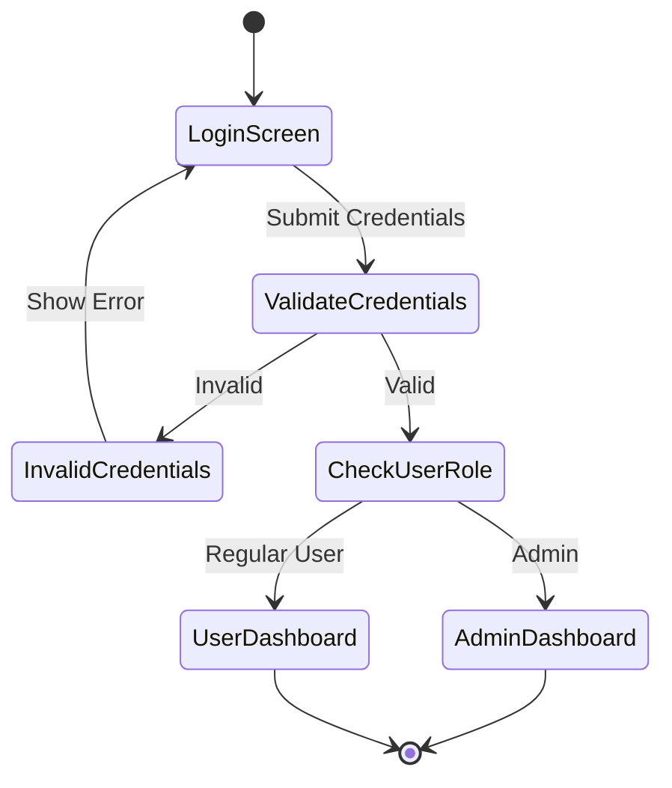

### Product Management Workflow
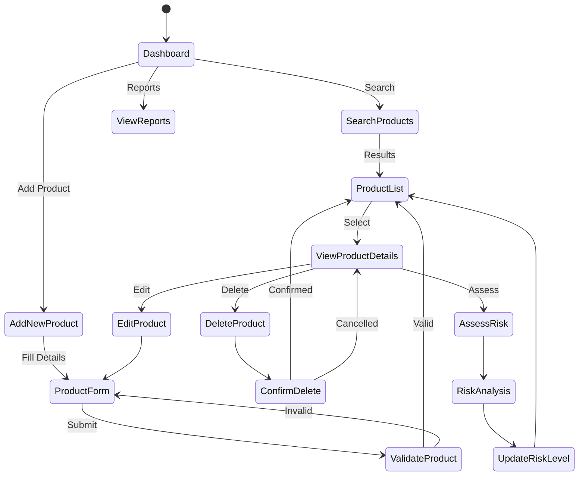

### Risk Assessment Workflow
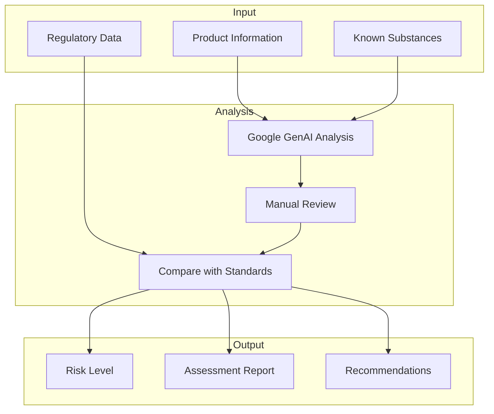

### Report Generation Workflow
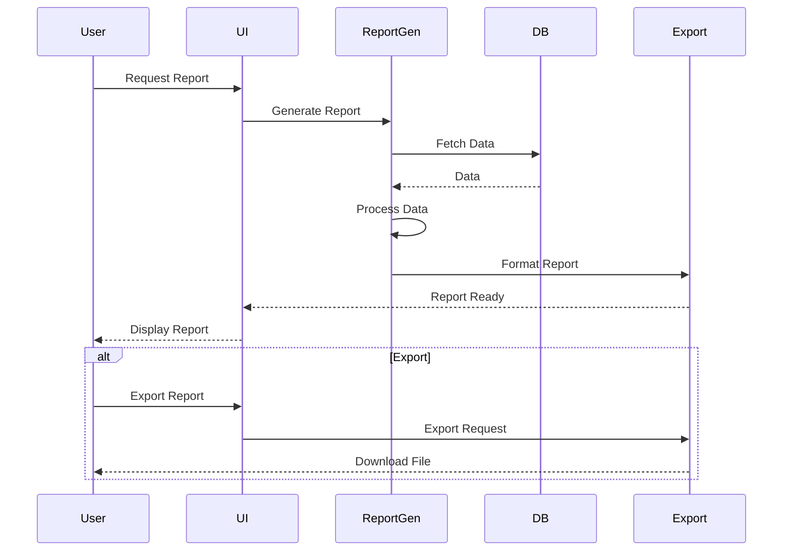

### Data Synchronization Workflow
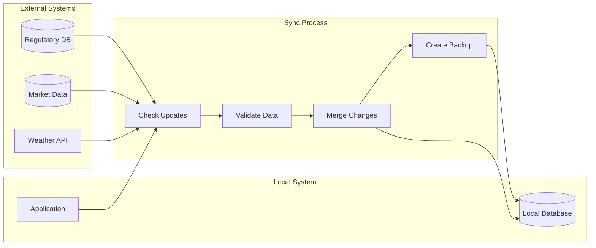

### Error Handling Workflow
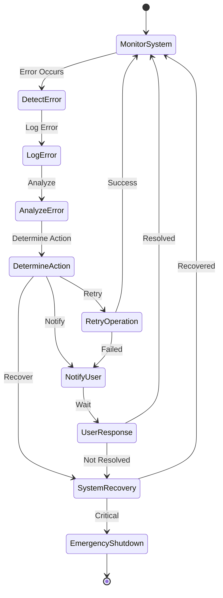

### Backup and Recovery Workflow
```mermaid
graph TB
    subgraph Backup Process
        Schedule[Schedule Backup]
        Prepare[Prepare Data]
        Compress[Compress Data]
        Store[Store Backup]
    end
    
    subgraph Recovery Process
        Select[Select Backup]
        Verify[Verify Integrity]
        Restore[Restore Data]
        Validate[Validate Recovery]
    end
    
    Schedule --> Prepare
    Prepare --> Compress
    Compress --> Store
    
    Select --> Verify
    Verify --> Restore
    Restore --> Validate
    Validate --> [*]
``` 